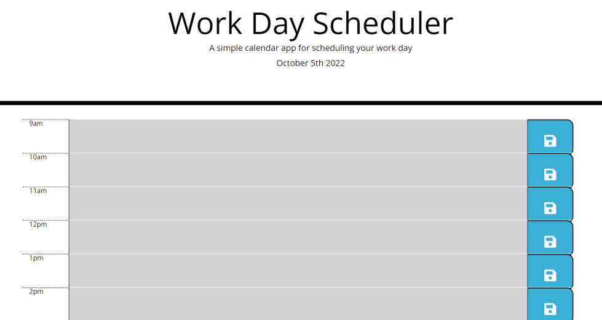

# Dom's Daily Planner:

## Description

This is a daily planner to help any poor soul navigate the treacherous waters of schedule navigation. [Here is a link to the application](https://thedomconrad.github.io/doms-daily-planner/)
Here I practiced using moment.js to display the current day/date on the top of our app as well as track the current hour and measure that to the respective information boxes - which then change colors.

## How to use

Simple click on an empty textbox and then click on a save button! Your schedule will be saved locally! Just delete your text and hit the blue button again to clear your data. Green means future, red means present, and grey is in the past.

## Screenshot of app



## the Code!
This is the entirety of the code. I'm proud of how short and sweet it is!

```
let currentHour = moment().format("H");
function yolo() {
  for (x = 9; x < 18; x++) {
    if (x < currentHour) {
      $("#" + x).addClass("past");
    }
    if (x == currentHour) {
      $("#" + x).addClass("present");
    }
    if (x > currentHour) {
      $("#" + x).addClass("future");
    }
  }
};
yolo();
$(".saveBtn").on("click", function () {
  for (x = 9; x < 18; x++) {
    var agendaItem = [];
    agendaItem = $("#" + x).val();
    localStorage.setItem("#" + x, agendaItem);
  }
});
let populatePlanner = function () {
  for (x = 9; x < 18; x++) {
    let frisbee = localStorage.getItem("#" + x) || [];
    let target = $("#" + x)
    $(target).text(frisbee);
  }
}
populatePlanner();
$("#currentDay").text(moment().format("MMMM Do YYYY"));

```

## Author Links
---[Linkedin](https://www.linkedin.com/in/dominic-conradson-76638b172/)---
[GitHub](https://github.com/theDomConrad/)---
[Portfolio](https://thedomconrad.github.io/Dominic-Conradson-Portfolio/)---